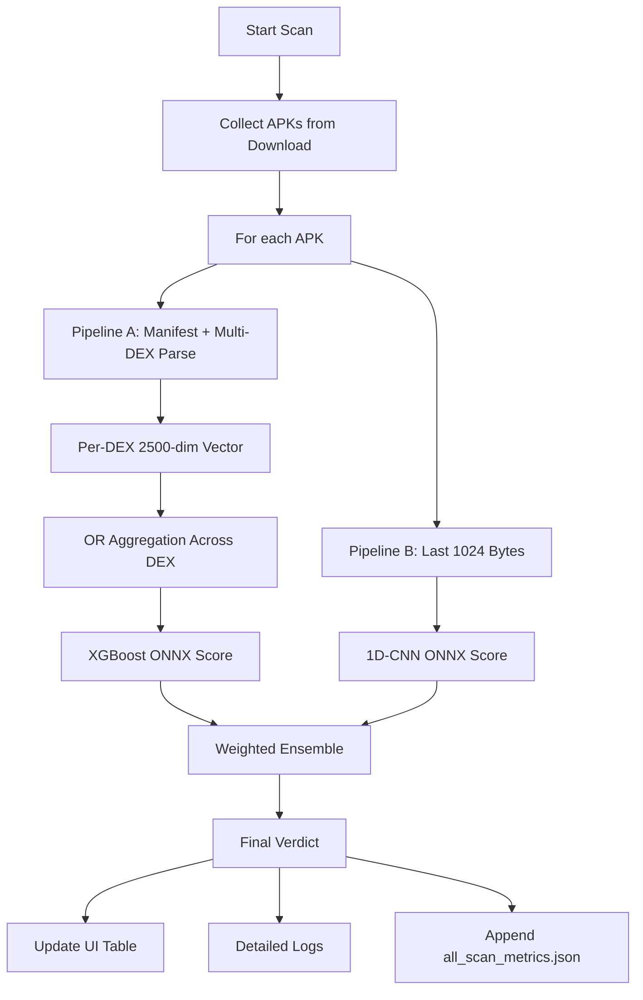

# VigiDroid: On-Device APK Malware Scanner

VigiDroid is an Android application for static malware screening of APK files directly on-device.  
It combines two lightweight inference pipelines:

- **Pipeline A (XGBoost ONNX):** structural/token-based APK feature analysis from manifest + Multi-DEX parsing.
- **Pipeline B (1D-CNN ONNX):** byte-level pattern analysis from trailing APK bytes.

The final verdict is computed using a **static performance-based weighted ensemble**.

---

## What It Is

VigiDroid is designed for practical, offline-first malware pre-screening of Android packages in the device `Download/` folder.  
It helps identify potentially malicious APKs without sending app binaries to external servers.

Core goals:
- Run fully on Android device using ONNX Runtime.
- Keep inference fast and lightweight.
- Provide traceable metrics for each scan.

---

## How It Works

### 1) APK Collection
- `ScanService` scans APK files from device `Download/`.
- Each APK is processed independently.

### 2) Pipeline A: Structural Analysis (XGBoost)
- Opens APK as ZIP.
- Parses:
  - `AndroidManifest.xml` features (permissions/intents normalization).
  - **All DEX files** using dynamic discovery:
    - `classes.dex`, `classes2.dex`, `classes3.dex`, ...
    - detected via `name.startsWith("classes") && name.endsWith(".dex")`.
- For each DEX:
  - Extract token/features.
  - Vectorize to fixed `2500`-dim binary feature vector.
- Aggregate all per-DEX vectors using logical OR (max pooling) into one master vector.
- Run XGBoost ONNX inference to produce malware probability score.

### 3) Pipeline B: Byte-Level Analysis (1D-CNN)
- Extracts last 1024 bytes from APK.
- Applies left zero-padding when needed.
- Runs 1D-CNN ONNX inference to produce malware probability score.

### 4) Final Decision (Weighted Ensemble)
- Uses fixed validation-performance weights:
  - `acc_xgb = 0.9748`
  - `acc_cnn = 0.9607843`
- Normalized weights:
  - `w_xgb = acc_xgb / (acc_xgb + acc_cnn)`
  - `w_cnn = acc_cnn / (acc_xgb + acc_cnn)`
- Final score:
  - `P(final) = w_xgb * P(xgb) + w_cnn * P(cnn)`
- Verdict:
  - `malware` if `P(final) >= 0.5`
  - `benign` otherwise

### 5) Metrics & UI
- Result table shows:
  - APK name
  - verdict
  - total time
  - total memory
- Logs show per-pipeline details (score, timing, memory).
- Metrics are accumulated in one file:
  - `all_scan_metrics.json`
- Export section supports **Download metric** to copy metrics to public Downloads.

---

## Workflow Diagram

---

## Novelty of This Work

1. **Multi-DEX aware structural scanning**  
   Many APK scanners only parse `classes.dex`. VigiDroid scans all `classes*.dex`, reducing blind spots where malware is hidden in secondary DEX files.

2. **Hybrid static fusion on-device**  
   Combines semantic/structural signals (XGBoost) and raw byte-distribution signals (1D-CNN) in a single mobile runtime.

3. **Performance-weighted fixed ensemble**  
   Uses validation-derived static weights to blend model outputs deterministically and reproducibly.

4. **Operational metrics for device-side evaluation**  
   Collects scan timing and memory behavior in a persistent aggregated JSON format for profiling and benchmarking.

---

## How To Reuse

### Prerequisites
- Android Studio (latest stable recommended)
- Android SDK + build tools
- Device/emulator with Android 11+ for full external storage flow
- ONNX model assets and feature file present in `app/src/main/assets/`

### Build & Run
1. Open `vigidroid` project in Android Studio.
2. Sync Gradle.
3. Build and run on device.
4. Grant storage permissions when prompted.

### Prepare APKs for Scanning
- Copy test APKs into device `Download/` directory.
- Tap **Start APK Scan** in app UI.

### Read Metrics
- In-app: use **Download metric** in Export Metrics section.
- ADB pull example:
  - `adb pull /sdcard/Android/data/com.msh.vigidroid/files/metrics/all_scan_metrics.json .`

### Replace/Re-train Models
1. Export new ONNX models with compatible input/output signatures:
   - XGBoost input dimension: `2500`
   - 1D-CNN input length: `1024` bytes
2. Replace model files in `app/src/main/assets/`.
3. Update feature vocabulary file for XGBoost if feature mapping changes.
4. Adjust ensemble constants in `ScanService` if validation metrics change.
5. Rebuild and re-test.

---

## Project Structure (Key Files)

- `app/src/main/java/com/msh/vigidroid/ScanService.java`  
  Core scan pipeline, feature extraction, model inference, metrics emission.

- `app/src/main/java/com/msh/vigidroid/MainActivity.java`  
  UI, scan triggering, result table, metric download action.

- `app/src/main/java/com/msh/vigidroid/MetricsWriter.java`  
  Aggregated JSON metric writing (`all_scan_metrics.json`).

- `app/src/main/assets/`  
  ONNX models and XGBoost feature schema assets.

---

## Notes

- This is a **static analysis pre-screening** tool, not a full dynamic sandbox.
- Model quality depends on dataset scope and domain shift.
- Always complement with additional security validation for production deployment.
