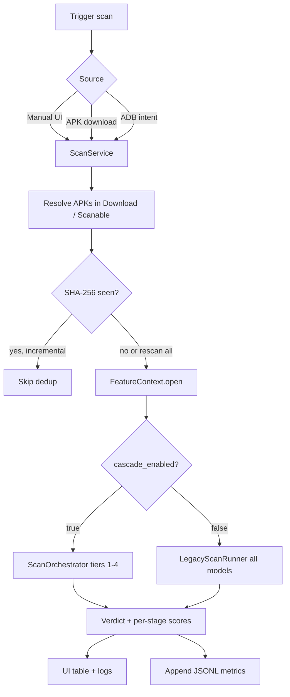

# VigiDroid: On-Device APK Malware Scanner

VigiDroid is an Android application for **offline static malware screening** of APK files directly on-device. It runs a fleet of ONNX models over manifest, permission, DEX-header, and byte-level features, then produces a verdict using either a **tiered cascade** (default, fast) or an **ablation mode** that runs every model on every APK (for evaluation).

Inference uses [ONNX Runtime for Android](https://onnxruntime.ai/). No APK bytes are sent to a remote server.

---

## What It Is

VigiDroid scans APKs found under the device `Download/` folder (and optional subfolders) and reports:

- A **verdict** (`benign`, `malware`, or `uncertain` in edge cases)
- **Per-model scores** and stage timing/memory
- **Session metrics** written as JSONL for thesis/device evaluation

Core design goals:

- **On-device only** — static analysis with ONNX Runtime.
- **Multi-DEX aware** — discovers all `classes*.dex` entries, not just `classes.dex`.
- **Parse once, infer many** — a shared `FeatureContext` opens each APK once and feeds all pipelines.
- **Traceable evaluation** — metrics split by scan mode for reproducible benchmarking.

---

## Scan Modes

| Mode | UI label | `cascade_enabled` | Behavior |
|------|----------|-------------------|----------|
| **Cascade** (default) | Cascade | `true` | Tiered early-exit pipeline; skips later tiers when confident. |
| **Ablation** | Ablation (all models) | `false` | Runs every registered model on every APK; no early exit. |

Toggle the mode in the app before starting a scan. The choice is persisted and selects which metrics file is written (see [Metrics](#metrics--export)).

---

## End-to-End Workflow

### 1. APK discovery

`ScanService` collects targets from:

- `Download/` (root)
- `Download/Scanable/` (default eval subfolder)
- Optional extra subfolders via `EXTRA_SCAN_SUBDIRS`
- A single APK path via `EXTRA_APK_PATH` (used by `ApkDownloadReceiver` on download complete)

APKs are sorted by filename. **Incremental scans** skip APKs whose SHA-256 was already processed (`ScanProcessedStore`); use **Rescan all** to bypass deduplication.

### 2. Shared feature extraction

For each APK, `FeatureContext.open()`:

- Opens the APK as a ZIP once
- Parses `AndroidManifest.xml` (permissions, intents, BoW tokens)
- Loads all `classes*.dex` byte arrays
- Reads the last 1024 APK bytes for the byte-CNN
- Computes SHA-256 for dedup and metrics alignment

### 3. Inference

**Cascade mode** (`ScanOrchestrator`) runs tiers defined in `app/src/main/assets/cascade_policy.json`:

| Tier | Models | Role |
|------|--------|------|
| 1 | `mldp_pruned_permission`, `broadcast_mldp_hybrid` | Fast permission / manifest signals; conservative malware OR on tier 1 |
| 2 | `mldp_dexheader_cascade_mode_b` (fallback: `mlp_header`) | DEX-header + permission cascade |
| 3 | `early_fusion_dex_manifest`, `manifest_xgb` | Multi-DEX structural + legacy XGBoost (2500-dim) |
| 4 | `bytecnn` | Final fusion of pattern + XGB + byte-CNN scores |

Each tier compares a **validation-weighted average score** against calibrated `t_low` / `t_high` bands. Scores at or below `t_low` → **benign** (early exit). Scores at or above `t_high` (or per-model malware threshold on tier 1) → **malware** (early exit). Otherwise the scan continues.

**Ablation mode** (`LegacyScanRunner`) runs all stages in `ModelRegistry.ALL_SCAN_STAGES` and computes a legacy XGBoost + 1D-CNN weighted ensemble for the displayed verdict.

### 4. Results & metrics

- The UI table shows APK name, verdict, wall time, and memory delta per scan.
- The log panel streams per-stage scores and timings.
- Each scan appends one JSON line; sessions append a summary record (see below).

---

## Workflow Diagram



---

## Model Catalog

Models live under `app/src/main/assets/models/{model_id}/` (see `ModelRegistry.java`). Each bundle should include `export_manifest.json` describing ONNX I/O shapes.

| `model_id` | Signal domain |
|------------|---------------|
| `mldp_pruned_permission` | MLDP-pruned manifest permissions |
| `broadcast_mldp_hybrid` | Permissions + broadcast receiver actions |
| `mldp_dexheader_cascade_mode_b` | Two-stage permission → DEX-header cascade |
| `mldp_dexheader_cascade_mode_a` | Single-stage permission + DEX-header (ablation) |
| `mlp_header` | DEX-header MLP fallback (tier 2) |
| `early_fusion_dex_manifest` | DEX header + manifest BoW early fusion |
| `dual_branch_dex_manifest` | Dual-branch variant (configurable tier-3 substitute) |
| `linregdroid_permission` | Linear permission model |
| `dexheader_broadcast_fusion` | DEX header + receiver-action fusion |
| `manifest_xgb` | Legacy XGBoost on 2500-dim multi-DEX tokens (`mh1m_2500_rp_XGBoost.onnx`) |
| `bytecnn` | 1D-CNN on last 1024 APK bytes (`bytecnn_basemodel_2020.onnx`) |

Legacy root assets (not under `models/`):

- `mh1m_2500_rp_XGBoost.onnx` + `mh1m_2500_rp_features.json.gzip`
- `bytecnn_basemodel_2020.onnx`

See `app/src/main/assets/README.md` for how to obtain missing legacy ONNX files. If XGBoost assets are absent, XGBoost stages report score `-1` and other models still run.

---

## Metrics & Export

Metrics are append-only JSONL under the app-private storage directory:

```
/sdcard/Android/data/com.msh.vigidroid/files/metrics/
```

| File | Written when |
|------|--------------|
| `scan_a_all_models.jsonl` | Ablation mode (`cascade_enabled=false`) |
| `scan_b_cascade.jsonl` | Cascade mode (`cascade_enabled=true`) |

Each line is either a `scan` record (per APK) or a `session` record (end of batch). Records include per-stage parse/infer timings, memory, cascade exit tier, battery snapshots, and provenance metadata.

**Pull with ADB:**

```bash
adb pull /sdcard/Android/data/com.msh.vigidroid/files/metrics/scan_b_cascade.jsonl .
adb pull /sdcard/Android/data/com.msh.vigidroid/files/metrics/scan_a_all_models.jsonl .
```

On a PC, merge JSONL to a single JSON array with `jsonl_to_json.py` (referenced in `MetricsWriter.java`).

The in-app **Download metric** button copies the legacy aggregate file to public `Download/` when present.

---

## Build & Run

### Prerequisites

- Android Studio (latest stable recommended)
- JDK 17
- Android SDK 36 (compile/target), min SDK 28
- Physical device or emulator with storage access
- ONNX model assets copied into `app/src/main/assets/` before building (see `app/src/main/assets/README.md`)

### Steps

1. Open this `vigidroid` directory in Android Studio.
2. Sync Gradle (`./gradlew assembleDebug` from the repo root also works).
3. Install on a device: **Run** or `./gradlew installDebug`.
4. Grant **All files access** (`MANAGE_EXTERNAL_STORAGE`) when prompted (required on Android 11+).
5. Place test APKs in `Download/` or `Download/Scanable/`.
6. Choose **Cascade** or **Ablation**, then tap **Start APK Scan**.

### Headless / automation (ADB)

Trigger a full rescan from the launcher activity (no button tap):

```bash
adb shell am start -n com.msh.vigidroid/.MainActivity \
  --ez auto_rescan_all true \
  --ez cascade_enabled true
```

Enqueue bulk scans without the UI via instrumented tests (`DeviceBulkScanTriggerTest`):

```bash
# Scan A — ablation, all models
adb shell am instrument -w -e class com.msh.vigidroid.DeviceBulkScanTriggerTest#enqueueScanA \
  com.msh.vigidroid.test/androidx.test.runner.AndroidJUnitRunner

# Scan B — cascade
adb shell am instrument -w -e class com.msh.vigidroid.DeviceBulkScanTriggerTest#enqueueScanB \
  com.msh.vigidroid.test/androidx.test.runner.AndroidJUnitRunner
```

`ScanService` is not exported; use the patterns above or call `ScanService.enqueueWork()` from app/test code. For ablation experiments you can pass `enabled_models` (model ID list) on the scan intent to limit which stages run.

---

## How To Reuse

### Use as an on-device scanner

1. Copy ONNX bundles into `app/src/main/assets/models/{model_id}/` following an existing bundle layout (`model.onnx`, `export_manifest.json`, `features/`, `thresholds.json`).
2. Register the model in `ModelRegistry.java` and wire a runner in `StageRunner` if it is a new architecture.
3. Rebuild and run parity tests (below).

### Swap or retrain a model

1. Export ONNX with **matching input/output names and shapes** documented in `export_manifest.json`.
2. Replace `model.onnx` and feature JSON files in the model's asset folder.
3. Update `thresholds.json` if decision thresholds change.
4. Run the corresponding `*ParityTest` on device to confirm extraction + inference match Python reference vectors in `parity_samples/`.

### Tune the cascade

Edit `app/src/main/assets/cascade_policy.json`:

- `enabled` — master switch (overridden per-scan by UI / `EXTRA_CASCADE_ENABLED`)
- `tiers[]` — model lists, `t_low`, `t_high`, flags (`conservative_malware_or`, `mlp_header_fallback`, `final`)
- `tier3_pattern_model` — `early_fusion_dex_manifest` or `dual_branch_dex_manifest`
- `model_weights` / `fusion_weights` — validation-performance weights for tier aggregation and tier-4 fusion

Recalibrate thresholds on a labeled validation set aligned by SHA-256 (see the `calibration` block in the policy file for the reference workflow).

### Export legacy 1D-CNN ONNX

From the parent thesis repo (requires sibling `1dcnn/` project):

```bash
python export_onnx.py
```

This delegates to `../1dcnn/export_onnx.py` and produces `bytecnn_basemodel_2020.onnx`.

### Run tests

```bash
# JVM unit tests (extractors, parsers, metrics)
./gradlew test

# Device instrumented tests (ONNX parity, pipeline integration)
./gradlew connectedAndroidTest
```

Parity tests under `app/src/androidTest/` compare on-device feature vectors and probabilities against bundled `parity_samples/`. **Model Health** (debug builds only) runs a quick ONNX smoke check from the main screen.

### Extend APK sources

- Add subfolders: pass `scan_subdirs` when starting `ScanService`.
- Auto-scan on download: `ApkDownloadReceiver` queues `ScanService` with `EXTRA_APK_PATH`.

---

## Project Structure (Key Files)

| Path | Role |
|------|------|
| `app/src/main/java/com/msh/vigidroid/ScanService.java` | Scan worker: APK discovery, dedup, mode dispatch, metrics |
| `app/src/main/java/com/msh/vigidroid/MainActivity.java` | UI, cascade toggle, scan triggers, metrics export |
| `app/src/main/java/com/msh/vigidroid/FeatureContext.java` | Parse-once APK context shared by all pipelines |
| `app/src/main/java/com/msh/vigidroid/ModelRegistry.java` | Canonical `model_id` → asset path mapping |
| `app/src/main/java/com/msh/vigidroid/CascadePolicy.java` | Loads `cascade_policy.json` |
| `app/src/main/java/com/msh/vigidroid/pipeline/ScanOrchestrator.java` | Tiered cascade with early exit |
| `app/src/main/java/com/msh/vigidroid/pipeline/LegacyScanRunner.java` | All-models ablation path |
| `app/src/main/java/com/msh/vigidroid/pipeline/StageRunner.java` | Per-model extract → vectorize → infer |
| `app/src/main/java/com/msh/vigidroid/MetricsWriter.java` | JSONL metrics (`scan_a_*`, `scan_b_*`) |
| `app/src/main/assets/cascade_policy.json` | Deployed cascade tiers, thresholds, weights |
| `app/src/main/assets/models/` | ONNX bundles + feature vocabularies + parity fixtures |
| `export_onnx.py` | Thin wrapper to export byte-CNN ONNX from sibling `1dcnn` repo |

---

## Notes

- VigiDroid is a **static pre-screening** tool, not a dynamic sandbox or AV replacement.
- Model accuracy depends on training data and domain shift; cascade thresholds target specific false-alarm / false-omission goals on the calibration set.
- Large `.onnx` weight files may not be checked into git — copy them locally before building.
- Complement on-device results with additional security review before production deployment decisions.
